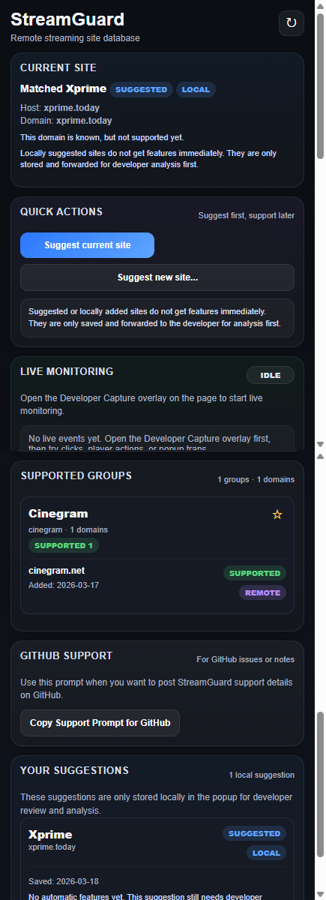

# StreamGuard


**StreamGuard** is a modular Chrome extension framework for streaming websites and mirror domains.

More streaming websites and site groups will be added to StreamGuard in the short term. The project is designed as a scalable **multi-site framework**, not as a one-off extension for a single website.

---

## Screenshot



---

## Overview

StreamGuard is built to:

- manage streaming domains and mirrors from a remote review database
- group related domains under one site group
- load site-specific modules only when a domain is supported
- provide a structured popup for status checks, suggestions, favorites, and updates
- help analyze new streaming sites through a built-in developer capture overlay

---

## Core goals

- remote domain and mirror management
- modular per-site feature loading
- popup and redirect hardening
- browser fullscreen enhancements
- user suggestion workflow
- developer-first site analysis
- scalable structure for future site groups

---

## Current features

### Remote backend integration
- reads remote domain data from a Google Sheet through an Apps Script web app
- supports remote suggestion submission with `POST`
- checks duplicate domains before submission
- refreshes cached remote data after successful submit
- does not depend directly on `docs.google.com/spreadsheets` inside the extension

### Popup UI
- current-site status detection
- grouped supported domain overview
- review queue visibility
- favorites
- search and filtering
- local suggestion tracking
- GitHub support prompt section
- update notification section for missing newly supported local site modules
- clearer feedback states for success, warnings, and errors

### Review workflow
Supported review statuses:

- `suggested`
- `reviewing`
- `supported`
- `rejected`

Additional review metadata:

- `review_note`
- `rejection_reason`
- `favorite_score`

### Developer tools
- developer capture overlay
- live monitoring while the developer overlay is open
- quick inspection of:
  - URL
  - hostname
  - iframes
  - suspicious links
  - player-related selectors

### Site module system
Site-specific logic lives under:

```text
modules/<group_slug>/
```

Current included site group:

- **Cinegram**
  - `adguard.js`
  - `fillbrowserscreen.js`
  - `meta.json`

---

## Project structure

```text
streamguard/
  manifest.json
  background.js
  remote_config.js
  popup/
    popup.html
    popup.css
    popup.js
  content/
    dev_capture.js
  modules/
    cinegram/
      adguard.js
      fillbrowserscreen.js
      meta.json
```

---

## Remote data model

The `domains` sheet uses these columns:

- `group_name`
- `domain`
- `status`
- `submitted_at`
- `submitted_note`
- `review_note`
- `rejection_reason`
- `favorite_score`

---

## Domain matching

StreamGuard does not rely on exact-only matching.

It supports:

- exact hostname matches
- subdomain matches
- mirror-style overlap matching

Typical logic:

```js
host === domain
host.endsWith("." + domain)
domain.endsWith("." + host)
```

---

## Suggestion flow

When a user suggests a site:

1. the domain is normalized
2. duplicates are checked
3. the suggestion is submitted to the Apps Script backend
4. remote cache is refreshed
5. the suggestion remains visible locally in the popup

Important:

A successful suggestion submission does **not** mean the site immediately gets support features.  
It only means the site has entered the review pipeline for developer analysis.

Suggested or locally added sites do **not** get automatic support features right away.

---

## Update-required behavior

StreamGuard follows a GitHub-based update flow rather than Chrome Web Store publishing.

That means:

- remote support data can change immediately
- local site modules still depend on the installed extension version

If a site is marked as `supported` in the remote database but the current installed extension version does not yet include that site's local module, StreamGuard shows an **update required** state instead of pretending support is already active.

This makes the support state clearer and more honest for users.

---

## Popup layout

The popup is designed to stay compact while keeping support states clear.

Typical sections include:

- Current Site
- Update Available
- Supported Groups
- Review Queue
- Your Suggestions
- GitHub Support

This keeps supported websites separate from websites that are still under review or only suggested.

---

## Cinegram support notes

### Cinegram AdGuard
The Cinegram ad module focuses on:

- removing Cinegram ad-related UI
- forcing the local ad-disable preference where possible
- blocking suspicious popup behavior
- hardening suspicious links and scripts
- preserving the real playback iframe host where needed

### Cinegram Browser Fullscreen
The Cinegram fullscreen module is built around the real player chain:

- `#player.watchbox.total`
- `.videomp4`
- `.loader`
- injected playback iframe

Features:

- Browser Fullscreen button
- toggle with `T`
- exit with `Escape`
- temporary auto-hide for visible controls
- controls return when moving the mouse over the fullscreen area

This is more stable than relying on generic layout containers because Cinegram injects playback dynamically.

---

## Developer Capture

Developer Capture is built for fast site analysis and reverse-engineering.

It helps identify:

- current URL and hostname
- iframe usage
- player containers
- suspicious links
- useful context for future module development

This makes it easier to add support for new streaming domains over time.

---

## Installation

1. Download or clone this repository
2. Open `chrome://extensions`
3. Enable **Developer mode**
4. Click **Load unpacked**
5. Select the `streamguard` folder

---

## GitHub

Project URL:

**https://github.com/D4RKNOISE/StreamGuard**

---

## Roadmap

Planned or ongoing improvements include:

- more supported site groups
- cleaner grouped update notifications
- richer review queue behavior
- better rejected and reviewing messaging
- improved popup UX
- stronger developer analysis flow
- more site-specific modules

---

## Notes

- StreamGuard is built for ongoing expansion
- supported status and local module availability are separate layers
- mirrors should be grouped through remote data, not duplicate module files
- the framework is intentionally modular to keep future growth manageable

---

## Disclaimer

StreamGuard is a browser-side support and analysis framework. It does not host, store, or distribute media content.
